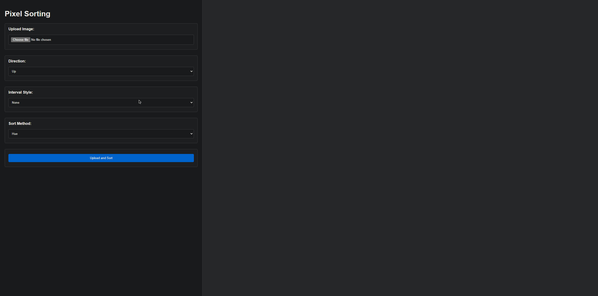

# Pixel Sort

Pixel Sort is a tool that lets you sort the pixels of an image in various ways.

## 🚀 How to Use

1. **Upload an Image**: Select an image from your device.
2. **Choose Sorting Direction**: Options include `Up`, `Down`, `Left`, and `Right`.
3. **Select Sorting Method**: Choose from `hue`, `saturation`, `laplace`, `lightness`, or `luminance`.
4. **Sort**: Click the "Upload and Sort" button to view the sorted image.

## 🔧 Setup

- **Backend**: Run the Flask server by using python app.py in the root directory.
- **Frontend**: Start the React app by moving into the `pixel-sorting-app` directory and using npm start.

---
